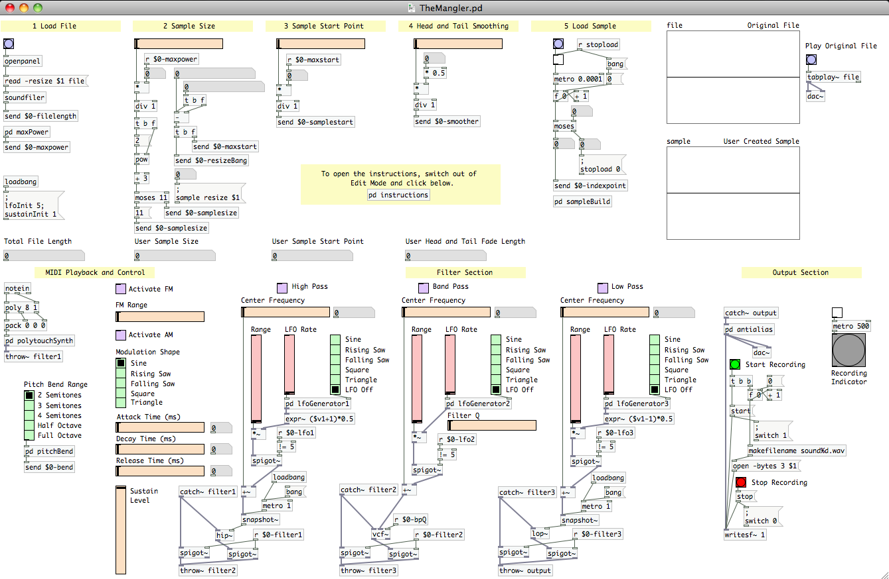
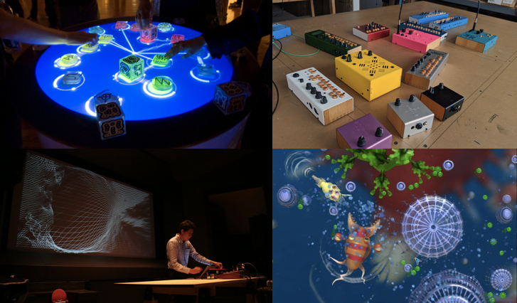
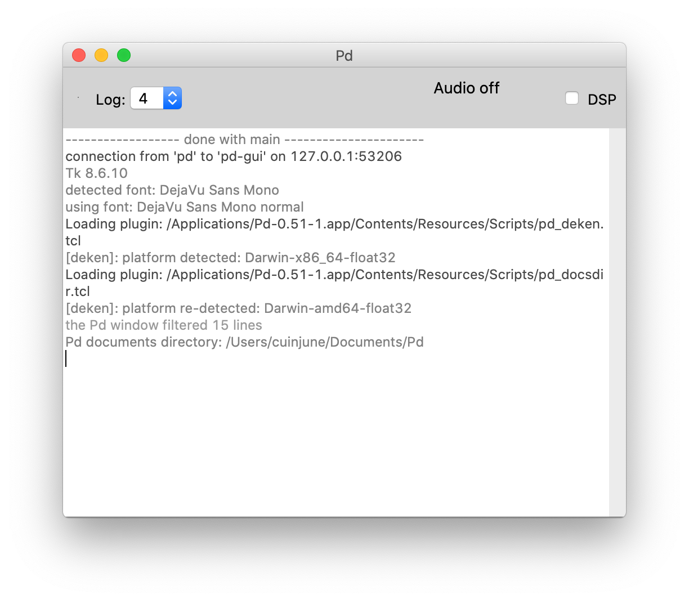
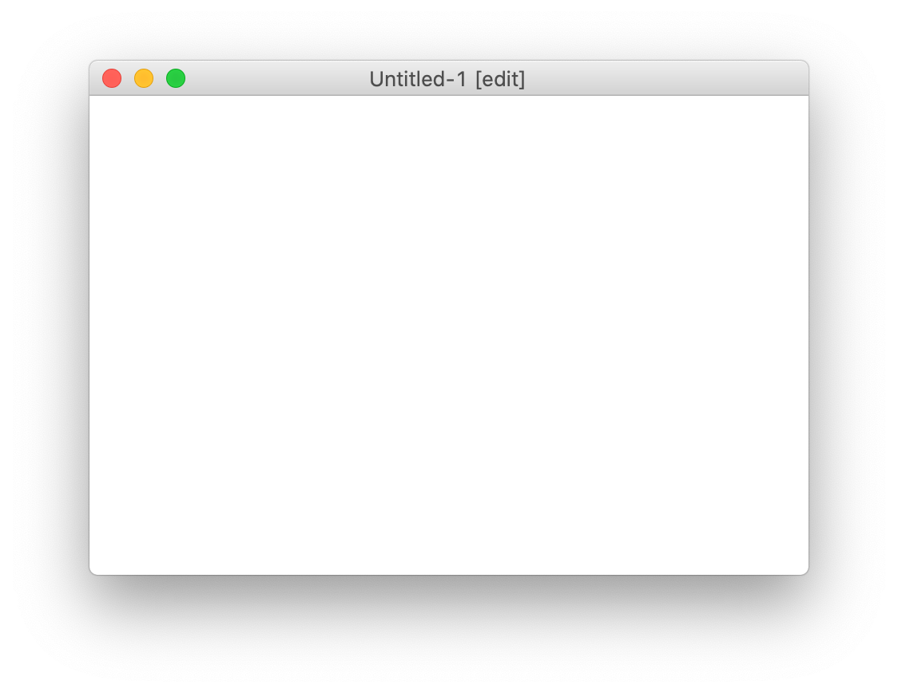
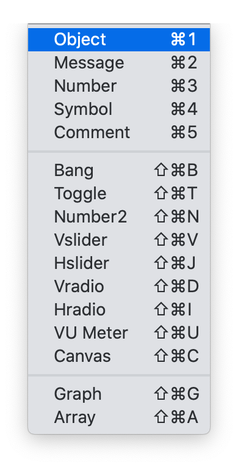
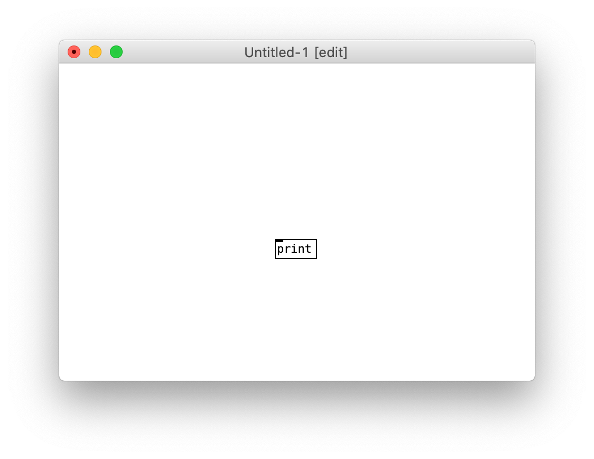
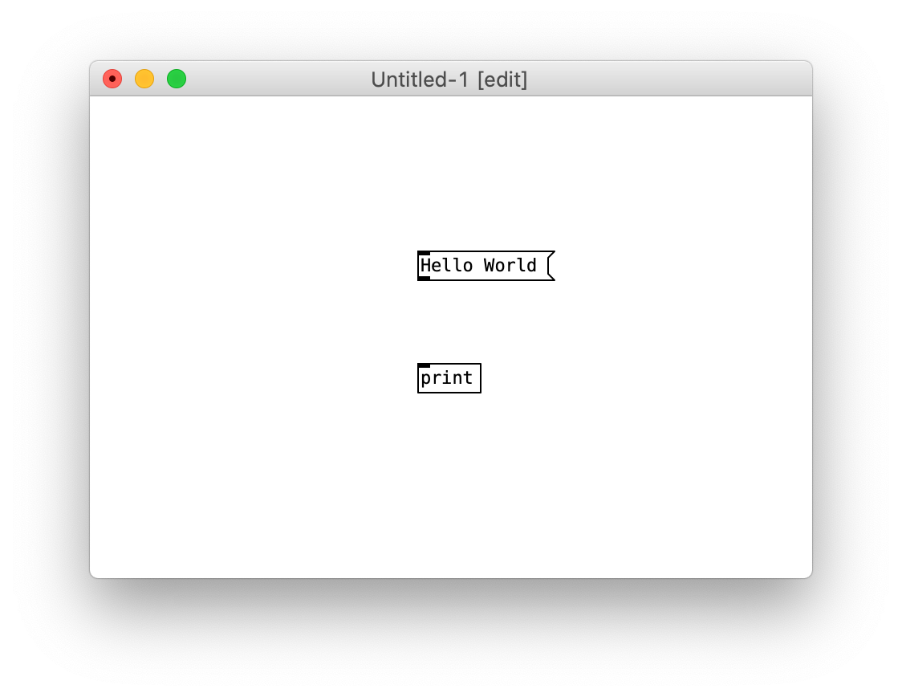
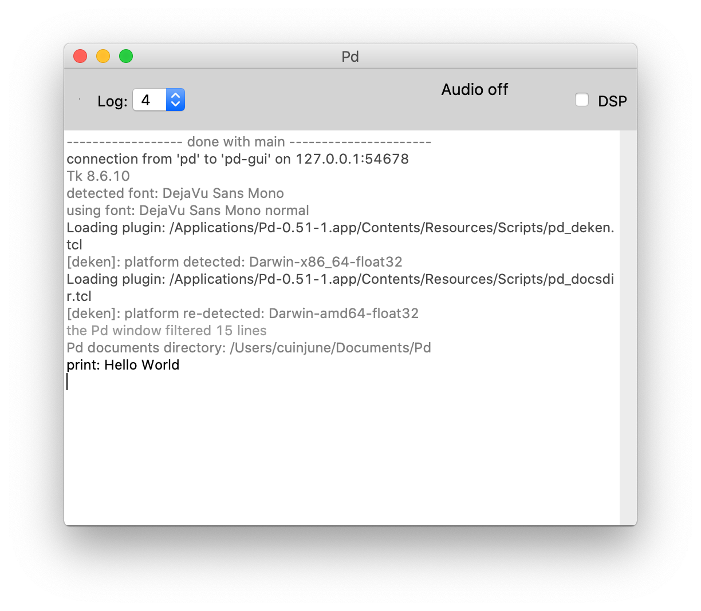

# Pure Data Tutorial for beginners


## Description
This is a short step-by-step Pure Data tutorial for complete beginners.  
After this tutorial, you will be able to understand the basics of Pure Data and create a simple musical instrument using it.

## Table of Contents
- [Introduction](#introduction)
- [Installation](#installation)
- [The Interface](#the-interface)
- [Building a Simple Sequencer](#building-a-simple-sequencer)
- [More Resources](#more-resources)

## Introduction

**Pure Data** (or Pd) is a real-time visual programming language designed for musicians, visual artists and performers to create software without writing lines of code. Pure Data is commonly used for live music performance, VJing, sound design, 2D/3D graphics processing, composition, audio analysis, interfacing with sensors, and cross-platform app and web development. Pure Data runs on macOS, Windows, Linux, Raspberry Pi, iOS, Android, and web browsers.


Programming with Pure Data is a unique interaction that is much closer to the experience of manipulating things in the physical world. The most basic unit of functionality is a box, and the program is formed by connecting these boxes together into diagrams that both represent the flow of data while actually performing the operations mapped out in the diagram. Because the programming is done visually, many artists find it a more intuitive tool than traditional text-oriented programming languages.


The real advantage of Pure Data is that it works in "real time". This means that changes can be made in the program even as it is running, and the user can see or hear the results immediately. This makes it a powerful tool for artists who would like to make sound or video in a live performance situation.



Pure Data has been used as the basis of a number of projects, as a prototyping language and a sound engine.




## Installation
Visit https://puredata.info/downloads/pure-data and click one of the download links depending on your platform.


If you are using **Windows**, open the downloaded installer file and follow the default instructions.

If you are using **macOS**, unzip the downloaded file and move it to the **Applications** folder.  
In case the app doesn't open because of the verification issue, open the app while holding down the **Ctrl** key.

If you are using **Linux**, run the following terminal commands to install and open Pure Data:
```
sudo apt-get update -y
sudo apt-get install -y puredata
puredata
```

## The Interface

If you open Pure Data, you will see a console window that looks like this:



The console window is mainly used to see information about the patch you are working on, as well as for debugging (correcting errors in your patch). So keep this window in a place where you can find it on your screen.

Under the "**File**" menu in the console window, select "**New**" to create a patch:


You will see a patch window that looks like this:



Under the "**Put**" menu in the patch window, select "**Object**" to place an object box in your patch.



Click on the patch to drop the object box in its place. Type "print" inside the box and click again outside the box, you will create the **[print]** object.



Under the "**Put**" menu in the patch window, select "**Message**" and type "Hello World" inside the box.



You should notice that both the object and the message boxes have small rectangles at the corners.   
If these are at the top of the object, they are called "**inlets**", and at the bottom they are called "**outlets**".  
The inlets and outlets are used to receive and send data between objects while they are connected.  
Click and drag the outlet of **[Hello World(** to the inlet of **[print]** to make a connection like this:


There are types of objects that you can interact with your mouse. A message box is one of them.  
To make the message box clickable, we need to change out of "**Edit Mode**" and into "**Play Mode**".  
You can do this by clicking on the "**Edit Mode**" item in the "**Edit**" menu, or by using the shortcut **Ctrl+E**. (**Cmd+E** on macOS)

When you enter into "**Play Mode**", you will see that the pointing finger cursor changes into an arrow cursor.  
This change signifies that the mouse will interact differently with the elements within the patch.


Now, if you click on the **[Hello World(** message box, you will see the message printed to the console window like this:




## Building a Simple Sequencer

[](#pd-tutorial)

## More Resources


