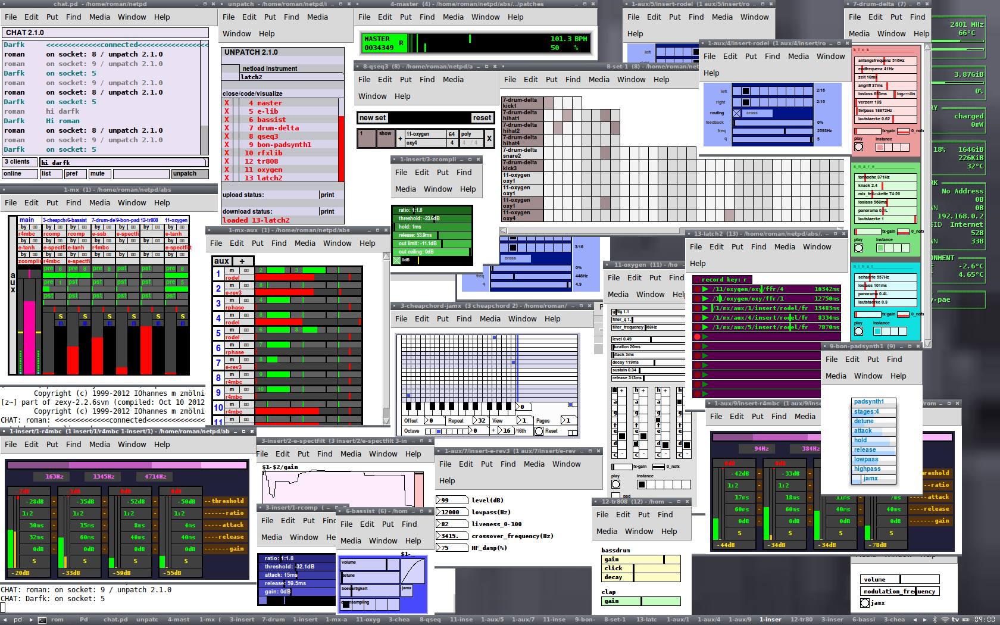
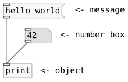
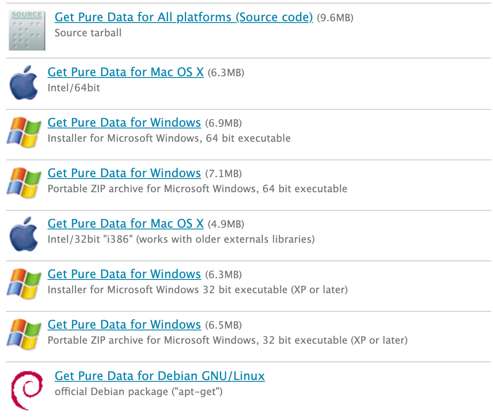

# Pure Data Tutorial for beginners

## Description
This is a short step-by-step Pure Data tutorial for complete beginners.  
After this tutorial, you will be able to understand the basics of Pure Data and create a simple musical instrument using it.

## Table of Contents
- [Introduction](#introduction)
- [Installation](#installation)
- [The Interface](#the-interface)
- [Building a Simple Sequencer](#building-a-simple-sequencer)

## Introduction

Pure Data (or Pd) is a real-time visual programming language designed for musicians, visual artists and performers to create software without writing lines of code. Pure Data is commonly used for live music performance, VJing, sound design, 2D/3D graphics processing, composition, audio analysis, interfacing with sensors, and cross-platform app and web development. Pure Data runs on macOS, Windows, Linux, Raspberry Pi, iOS, Android, and web browsers.



Programming with Pure Data is a unique interaction that is much closer to the experience of manipulating things in the physical world. The most basic unit of functionality is a box, and the program is formed by connecting these boxes together into diagrams that both represent the flow of data while actually performing the operations mapped out in the diagram. Because the programming is done visually, many artists find it a more intuitive tool than traditional text-oriented programming languages.



The real advantage of Pure Data is that it works in "real time". This means that changes can be made in the program even as it is running, and the user can see or hear the results immediately. This makes it a powerful tool for artists who would like to make sound or video in a live performance situation.

Pure Data has been used as the basis of a number of projects, as a prototyping language and a sound engine.


## Installation
Visit https://puredata.info/downloads/pure-data and click one of the links depending on your platform to download Pure Data.



If you are using Windows, open the downloaded installer file and follow the default instructions.

If you are using macOS, unzip the downloaded file, and move it to the Applications folder.  
In case the app doesn't open because of the verification issue, open the app while holding down the Control key.

If you are using Linux, run the following terminal commands to install and run Pure Data:
```
sudo apt-get update -y
sudo apt-get install -y puredata
puredata
```


## The Interface

## Building a Simple Sequencer


[](#pd-tutorial)


See the image above!
